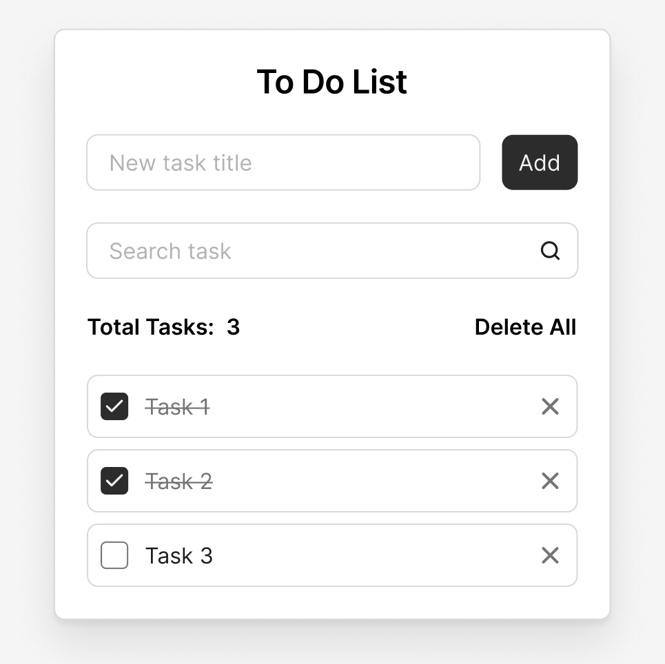

# 📝 ToDo List на чистом JavaScript | ООП

Минималистичное и элегантное приложение для управления задачами, созданное с использованием чистого **HTML5**, **CSS3** и **Vanilla JavaScript** с применением принципов объектно-ориентированного программирования.


## ✨ Возможности

### 🎯 Основные функции

- ✅ **Добавление задач** - быстрое создание новых задач через интуитивное поле ввода
- 🔍 **Поиск по задачам** - мгновенный поиск в реальном времени с фильтрацией результатов
- ✔️ **Отметка выполнения** - переключение статуса задачи между активной и выполненной
- 🗑️ **Удаление задач** - удаление отдельных задач или всех задач сразу
- 📊 **Счётчик задач** - отображение общего количества активных задач

### 💾 Сохранение данных

- 💾 **Автосохранение** - все данные автоматически сохраняются в `localStorage`
- 🔄 **Восстановление** - задачи восстанавливаются после перезагрузки страницы
- 🌐 **Оффлайн-работа** - полная функциональность без интернет-соединения

### ⌨️ Удобство использования

- 🎹 **Горячие клавиши** - поддержка Enter для добавления задач
- 🔍 **Автофокус** - автоматический фокус на поле ввода
- 📱 **Адаптивность** - полная поддержка мобильных устройств
- ♿ **Доступность** - семантическая разметка и ARIA-атрибуты

## 🎨 Дизайн

Интерфейс приложения создан на основе бесплатного макета Figma.



🔗 **[Ссылка на макет в Figma](https://www.figma.com/design/5g3oOYX6GNlezUCuk1xmaS/To-Do-List)**

## 🛠️ Технологический стек

### Frontend

- **HTML5** - семантическая разметка и доступность
- **CSS3** - современные стили с Flexbox/Grid, CSS-переменными
- **Vanilla JavaScript** - читый JS без зависимостей, ООП подход

### Browser APIs

- **LocalStorage API** - хранение данных в браузере
- **DOM API** - манипуляция элементами страницы
- **Event API** - обработка пользовательских событий

## 🚀 Быстрый старт

### Установка и запуск

1. **Клонируй репозиторий:**
   ```bash
   git clone git@github.com:Khudatbegow/vanilla-javascript-todo-app.git
   ```
2. **Перейди в директорию проекта:**

   ```bash
   cd vanilla-javascript-todo-app
   ```

3. **Запусти приложение:**
   - Открой файл `index.html` в любом современном браузере
   - или используй расширение **Live Server** в VS Code для режима разработки

---

## 🎯 Функционал

- ➕ **Добавление задачи** — введи текст в поле **New task title** и нажми **Enter** или кнопку **Add**
- 🔍 **Поиск задач** — фильтрация списка через поле **Search task**
- ☑️ **Отметка выполнения** — отметь чекбокс рядом с задачей
- 🗑️ **Удаление задачи** — кликни по иконке корзины
- 🧹 **Очистка списка** — кнопка **Delete All** удаляет все задачи

---

## 🌟 Особенности реализации

### 🏗️ Архитектура

- 🎨 **Модульный CSS** — компонентный подход к оформлению
- ⚙️ **ООП в JavaScript** — использование классов и инкапсуляции логики
- 🧩 **Чистые функции** — предсказуемость и простота тестирования

---

## 👨‍💻 Автор

**Худатбегов Магомед**

📬 Telegram: [@Khudatbegow](https://t.me/Khudatbegow)  
💻 GitHub: [@Khudatbegow](https://github.com/Khudatbegow)

---

> Проект создан в образовательных целях
